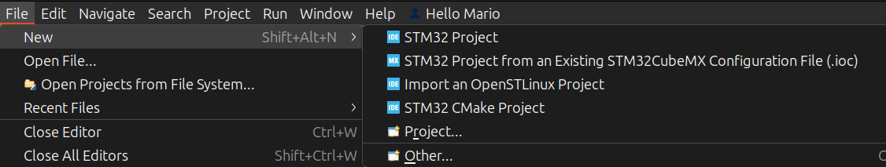
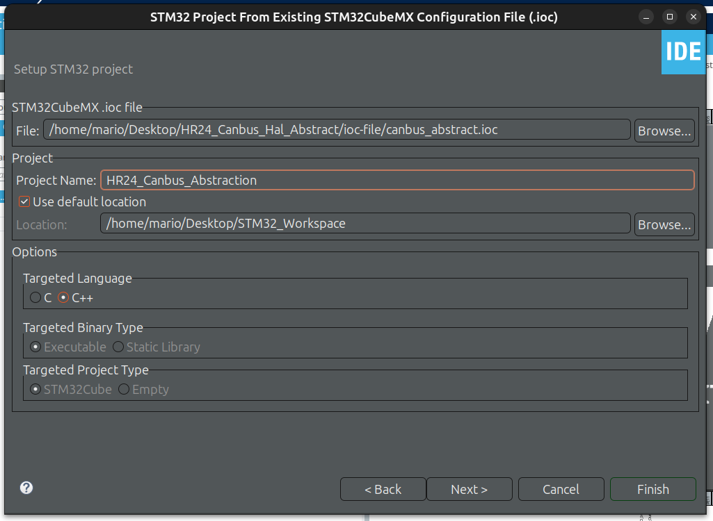
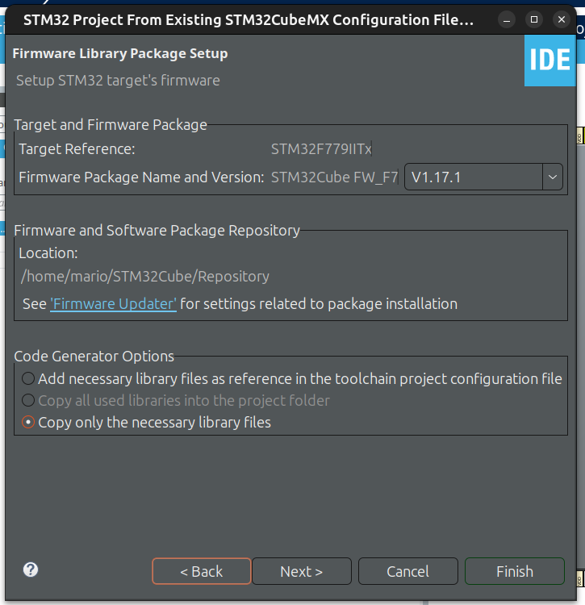
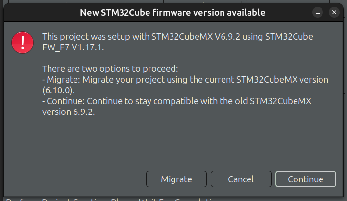
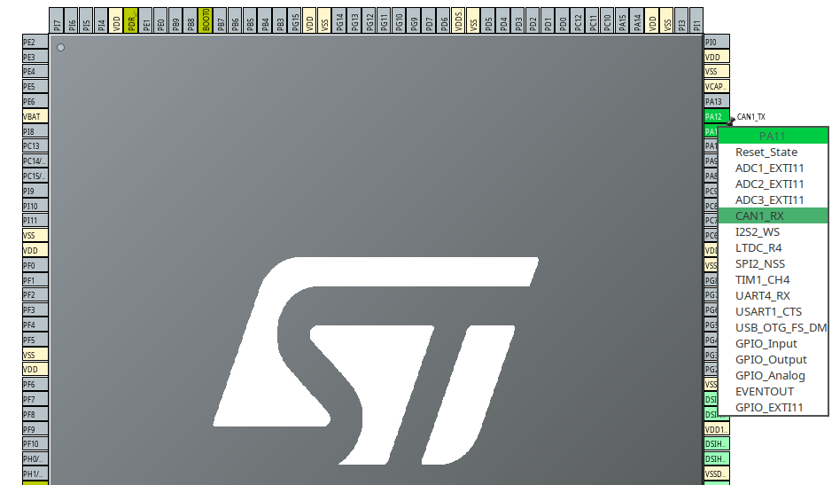
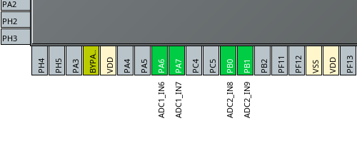
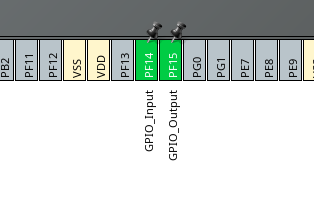

# HR24_Canbus_Hal_Abstract
## Project Setup Instructions
### 1) Create a new project from the existing ioc file.
If you don't have any projects open or any projects in general, you can just click the "Create a New STM32 Project from an Existing..." option in the Project Explorer window. You can also just navigate to the "File" tab in the top left and select "New," then "Create a New STM32 Project from an Existing..."

 

  

 

### 2) Set up the project accordingly.
All you really need to know is the location where the.ioc file is stored. You can name the project whatever you want. The targeted language should be C++, and from there you can hit "Next", and if "Copy only necessary library files" isn't selected already, then select it. You can see the images below for reference.

 

  

 
 

  

 

**Side note:** If you get a message such as the one seen below, then just select migrate. It's just asking if you want to update the project to meet your STM32 IDE's version. 

 

  

 

### 3) Pin configuration.
First, set up the CAN pins for the chip by clicking on the "Connectivity" tab on the left and selecting CAN1 and CAN2. Move the pin location of CAN1RX to be next to CAN1TX by clicking on PA11 and selecting CAN1RX from the drop-down.

 

  

 

Next, setup the ADC pin connections by clicking on the "Analog" tab on the left and enabling both ADC1 and ADC2. Select the input pins IN6 and IN7 for ADC1, and the input pins IN8 and IN9 for ADC2. The following pins on the chip should now be lit green, similar to how the CAN pins are.

 

  

 

Finally, navigate to the bottom half of the chip and select PF14 to be GPIO input and PF15 to be GPIO output from the drop-down menu.

 

  

 

That's all. Now save the file and click on "Generate Code," and if you get a pop-up along the lines of "C++ Perspective..." just click yes.
